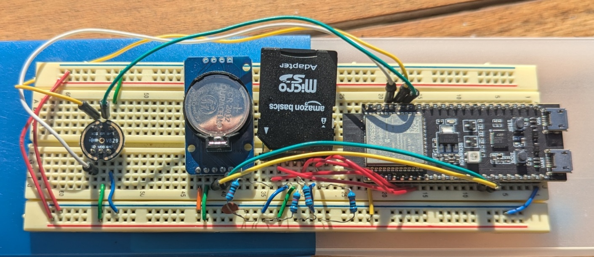

# Embedded Acoustic Monitoring System

## Overview

This project was developed to autonomously monitor outdoor acoustic activity over long periods while requiring minimal maintenance. Rather than continuously recording audio, the device identifies potential events in real time and records only when activity is detected. This greatly reduces storage requirements while allowing the system to operate unattended for months at a time.

The prototype combines an ESP32-C3 development board with an I2S microphone, real-time clock, and SD card storage. Designed with low power consumption in mind, the system was capable of operating from a small photovoltaic power source, making it practical for long-term deployment without frequent intervention.

## From Data Collection to Analysis

Collecting audio was only one part of the project. After deployment, the recorded samples were processed through a custom Python analysis pipeline that filtered false detections using a PyTorch machine learning model. Separating lightweight event detection on the embedded device from more computationally intensive desktop analysis allowed the embedded system to remain efficient while still producing high-quality results.

The completed pipeline successfully collected and organized months of timestamped audio, transforming large amounts of raw environmental data into a manageable dataset suitable for long-term analysis. This project combined embedded systems, signal processing, and machine learning into a complete end-to-end solution, from autonomous data collection to automated classification.