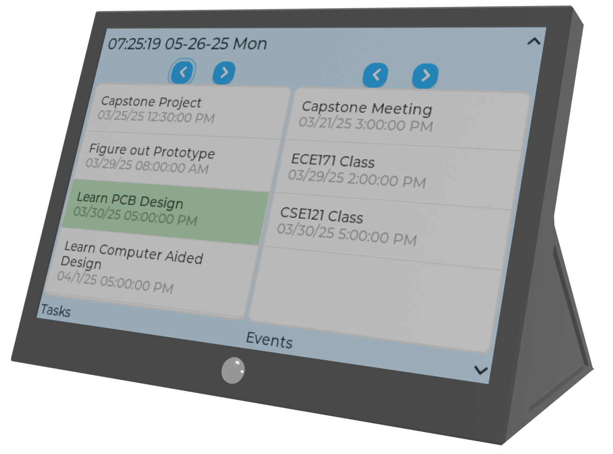

# Schedule Companion

## Overview

Developed as part of a senior capstone project, this offline scheduling system was designed to keep task management available even when internet connectivity could not be guaranteed. Rather than relying on a constant connection to a cloud service, the system allows users to continue creating and managing schedules locally, automatically synchronizing changes once connectivity is restored.

The project combined embedded hardware, cloud services, and a web interface into a unified scheduling platform, demonstrating how edge devices can provide reliable access to data without sacrificing the convenience of cloud synchronization.

## My Contribution

My primary responsibility was the embedded backend running on an ESP32-based device. I developed the firmware responsible for communicating with cloud services, maintaining a local copy of scheduling data on an SD card, and synchronizing updates between local storage and the remote database. This approach allowed the device to continue operating independently during network interruptions while preserving data integrity once connectivity returned.

Working as part of a multidisciplinary engineering team provided valuable experience integrating embedded software with web development and cloud infrastructure. The project emphasized designing reliable systems that gracefully handle real-world conditions rather than assuming constant network availability.

